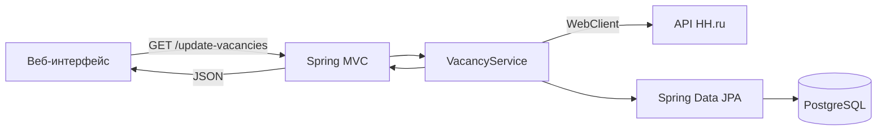

# Vacancies Manager

Веб-приложение для загрузки и просмотра вакансий с [HH.ru](https://hh.ru). Сервис получает данные через публичный API, сохраняет актуальную выборку в PostgreSQL и выводит её в браузере.

## Возможности

- получение вакансий из API HH.ru;
- фильтрация по названию, городу, компании, минимальной зарплате и типу занятости;
- пагинация результатов;
- переход к исходной вакансии на HH.ru;
- хранение данных в PostgreSQL;
- управление схемой базы данных через Liquibase;
- контейнерный запуск приложения и базы данных.

## Технологии

| Компонент | Технологии |
| --- | --- |
| Backend | Java 17, Spring Boot 3.2, Spring MVC |
| Доступ к данным | Spring Data JPA, Hibernate |
| HTTP-клиент | Spring WebClient |
| Интерфейс | Thymeleaf, HTML, CSS, JavaScript |
| База данных | PostgreSQL |
| Миграции | Liquibase |
| Сборка | Maven |
| Инфраструктура | Docker, Docker Compose |

## Как это работает



При запросе списка сервис очищает предыдущую выборку, загружает до десяти страниц вакансий по запросу `python`, сохраняет их в базе, применяет фильтры и возвращает выбранную страницу в формате JSON.

## Быстрый старт с Docker

### Требования

- Docker Engine или Docker Desktop;
- Docker Compose v2.

Из корня репозитория:

```bash
cd PROJECT/hh-parser-main
docker compose up --build
```

После успешного запуска:

- веб-интерфейс — [http://localhost:8080](http://localhost:8080);
- PostgreSQL — `localhost:5432`;
- база данных — `vacancies`;
- пользователь и пароль — `postgres`.

Остановка:

```bash
docker compose down
```

Для полного сброса базы данных удалите также именованный volume:

```bash
docker compose down -v
```

## Локальный запуск

Потребуются JDK 17, Maven 3.8+ и запущенный PostgreSQL.

Создайте базу:

```sql
CREATE DATABASE vacancies;
```

Затем передайте параметры подключения и запустите приложение:

```bash
SPRING_DATASOURCE_URL=jdbc:postgresql://localhost:5432/vacancies \
SPRING_DATASOURCE_USERNAME=postgres \
SPRING_DATASOURCE_PASSWORD=postgres \
mvn spring-boot:run
```

При локальном запуске приложение доступно на [http://localhost:5000](http://localhost:5000). Liquibase применит миграции автоматически.

В IntelliJ IDEA можно открыть `pom.xml` как Maven-проект, задать те же переменные окружения в Run Configuration и запустить класс `VacanciesManagerApplication`.

## Конфигурация

Основные параметры можно изменить через переменные окружения:

| Переменная | Значение по умолчанию | Назначение |
| --- | --- | --- |
| `SPRING_DATASOURCE_URL` | `jdbc:postgresql://db:5432/vacancies` | JDBC URL базы данных |
| `SPRING_DATASOURCE_USERNAME` | `postgres` | пользователь PostgreSQL |
| `SPRING_DATASOURCE_PASSWORD` | `postgres` | пароль PostgreSQL |
| `HH_API_BASE_URL` | `https://api.hh.ru` | адрес API HH.ru |
| `HH_API_USER_AGENT` | `Mozilla/5.0` | заголовок User-Agent |

Параметры по умолчанию находятся в `src/main/resources/application.properties`.

## HTTP-маршруты

| Метод | Путь | Описание |
| --- | --- | --- |
| `GET` | `/` | главная страница |
| `GET` | `/update-vacancies` | обновление выборки и получение вакансий |

Endpoint `/update-vacancies` принимает параметры `title`, `city`, `company`, `salary`, `employment`, `description`, `page` и `size`.

Пример:

```bash
curl "http://localhost:8080/update-vacancies?city=Москва&salary=150000&page=0&size=10"
```

Ответ содержит поля `data`, `total`, `page` и `size`.

## Структура

```text
src/main/
├── java/com/vacancies/
│   ├── config/       # WebClient и настройки источников
│   ├── controller/   # HTTP-маршруты
│   ├── dto/          # модели ответа HH.ru
│   ├── model/        # JPA-сущности
│   ├── parser/       # интеграция с источниками вакансий
│   ├── repository/   # доступ к PostgreSQL
│   └── service/      # загрузка, фильтрация и пагинация
└── resources/
    ├── db/changelog/ # миграции Liquibase
    ├── static/       # CSS и JavaScript
    └── templates/    # Thymeleaf-шаблоны
```

## Проверка сборки

```bash
mvn test
```

В проекте пока нет собственных автоматических тестов; команда проверяет компиляцию и стандартный Maven lifecycle.

Сборка проверена на JDK 17. На более новых версиях JDK используемая версия Lombok может потребовать обновления.

## Ограничения текущей версии

- активен только источник HH.ru;
- поисковый запрос зафиксирован как `python`;
- каждый запрос списка полностью обновляет данные;
- подробное описание вакансии отдельно не загружается;
- учетные данные PostgreSQL в Docker Compose предназначены только для локальной разработки.

Для подключения новых источников предусмотрен интерфейс `VacancyParser`.
